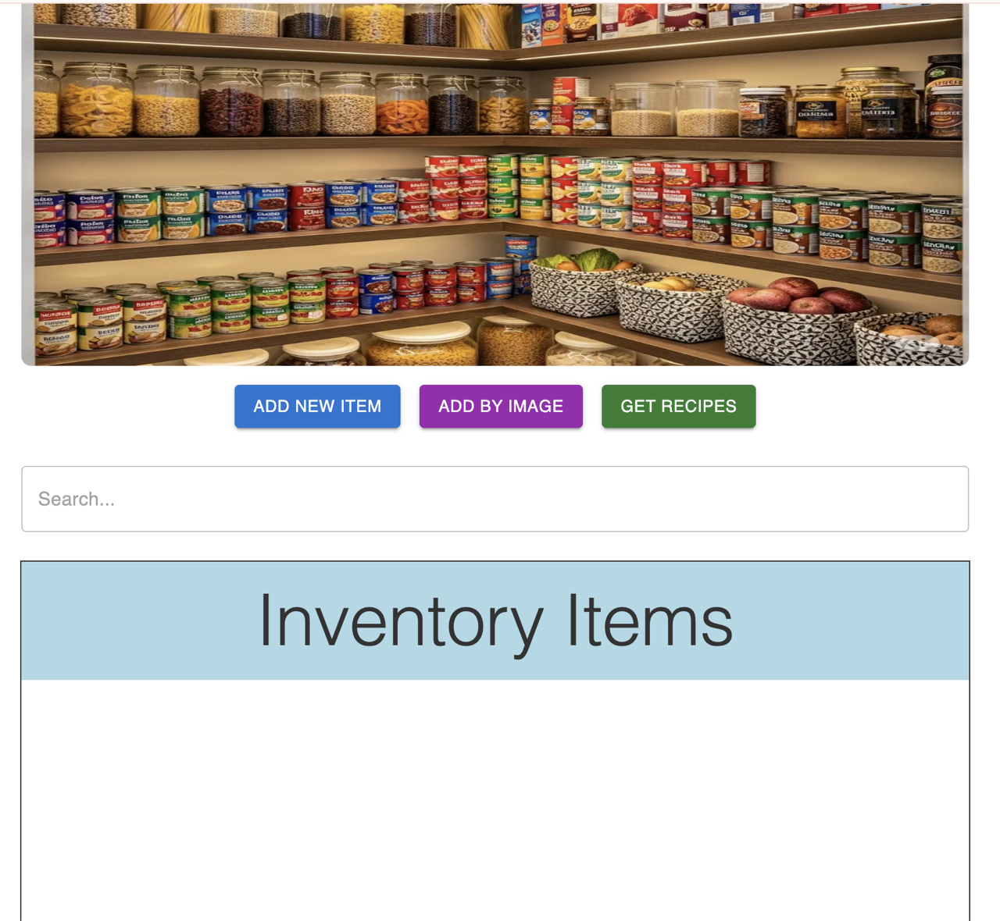

# Multimodal AI Pantry & Recipe Generator

A full-stack inventory app for tracking what's in your pantry. Built with Next.js and Firebase, it uses Google Gemini's vision model to identify food items from photos and generates recipe ideas from whatever you have on hand.

**Live demo:** https://pantry-tracker-project-seven.vercel.app/



## Features
- Add pantry items by typing or by uploading a photo
- Gemini's vision model identifies the food in an uploaded image and logs it automatically
- Tracks item quantities in Firestore, with add, remove, and search controls
- Generates recipe ideas on demand by sending the current pantry list to Gemini

## Tech stack
- Next.js (App Router) and React
- Google Gemini API (vision and text)
- Firebase / Firestore for storage
- MUI for the interface

## Running locally
1. Install dependencies:
   ```bash
   npm install
   ```
2. Create a `.env.local` file with your keys:
   ```
   GEMINI_API_KEY=your_gemini_key
   NEXT_PUBLIC_FIREBASE_API_KEY=your_firebase_api_key
   NEXT_PUBLIC_FIREBASE_AUTH_DOMAIN=your_firebase_auth_domain
   NEXT_PUBLIC_FIREBASE_PROJECT_ID=your_firebase_project_id
   NEXT_PUBLIC_FIREBASE_STORAGE_BUCKET=your_firebase_storage_bucket
   NEXT_PUBLIC_FIREBASE_MESSAGING_SENDER_ID=your_firebase_sender_id
   NEXT_PUBLIC_FIREBASE_APP_ID=your_firebase_app_id
   ```
3. Start the dev server:
   ```bash
   npm run dev
   ```
4. Open http://localhost:3000 in your browser.
